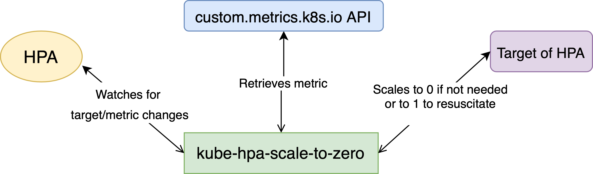

# kube-hpa-scale-to-zero


Simulate the [HPAScaleToZero](https://kubernetes.io/docs/reference/command-line-tools-reference/feature-gates/) feature gate, especially for managed Kubernetes clusters,
as they don't usually support non-stable feature gates.

`kube-hpa-scale-to-zero` scales down to `zero` workloads instrumented by HPA when the current value of the used _custom_ metric is `zero` and resuscitates them when needed.



If you're also tired of (big) Pods (thus Nodes) that are only used 3 hours a day, give this a try ;)

Check the code and comments in [main.py](./main.py) for more details.

### Run/Deploy

- Via `Helm`:

```bash
helm repo add kube-hpa-scale-to-zero https://machine424.github.io/kube-hpa-scale-to-zero
helm install RELEASE_NAME kube-hpa-scale-to-zero/kube-hpa-scale-to-zero -n RELEASE_NAMESPACE
```
- Run the docker image:

Docker images are published [here](https://hub.docker.com/r/machine424/kube-hpa-scale-to-zero).

- Or clone the repo and run (needs Python `>=3.10`):

```bash
# python main.py --help
python main.py --hpa-label-selector foo=bar,bar=foo --hpa-namespace foo
```

### Test

Check [test.yaml](./.github/workflows/test.yaml) for how tests are run in CI.